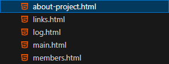

# Проектная (учебная) практика
# Базовая часть (Документация по созданию статического сайта)
## Введение
Документация описывает процесс разработки статического сайта, созданного в рамках базовой части проектной практики. Сайт содержит основную информацию о проекте, его участниках, ходе выполнения и ресурсах

- **Формат создания сайта**: Использования языков HTML и CSS
- **Репозиторий**: [Папка site](https://github.com/mariiiiiinad/Practice/tree/main/site)
- **Стек технологий**: HTML, CSS
___
## Структура сайта
#### Основные страницы:
| Страница | Назначение                                             |
|----------|--------------------------------------------------------|
|Главная   |Страница с аннотацией проекта                           |
|О проекте |Описание проекта и его цели, задачи, проблематика и т.д.|
|Команда   |Команда проекта, какова роль каждого участника          |
|Журнал    |Страница со статьями о проделанной работы               |
|Ресурсы   |Полезные ссылки, источники, партнёры                    |
___
# Процесс разработки
## 1. Установка инструментов для создания сайта
Прежде чем начать создание сайта, необходимо установить среду, где будет выполняться работа. Для этой задачи был выбран Visual Studio Code.
Также были установлены расширения, для облегчения и ускорения работы:
| Расширение           | Назначение                                                                |
|----------------------|---------------------------------------------------------------------------|
|Live Server           |Запускает сайт с автообновлением                                           |
|Auto Rename Tag       |Автоматически переименовывает парные HTML-теги                             |
|Auto Complete Tag     |Автоматически закрывает HTML/XML-теги при вводе                            |
|Auto Close Tag        |Автоматически добавляет закрывающий тег при вводе >                        |
|eCSStractor for VSCode|Позволяет выносить CSS из HTML-файлов в отдельный .css-файл                |
|indent-rainbow        |Подсвечивает отступы (indents) в коде разными цветами для лучшей читаемости|
## 2. Создание структуры сайта
После того как все было подготовлено, необоходимо было определить структуру сайта. Так как требовалось создать всего 5 страниц, было принято решение сделать все эти страницы главными с быстрым доступом из header.
Чтобы это реализовать, первым делом было создано 5 файлов с расширением html для каждой из страниц.


## 3. Стили
На этапе проектирования я создала наброски будущего интерфейса в графическом редакторе Figma, где выбрала цветовую палитру (основные цвета – оттенки синего и чистый белый), подобрала гармоничные шрифты (Roboto), разработала концепцию интерактивных элементов.
Реализация стилей происходит с помощью языка CSS. Файл с данным расширением был подключен к html с помощью ссылки:
```HTML
<link rel="stylesheet" href="./style.css">
```
Реализация стилей в CSS осуществлялась по мере добавления элементов через набор правил, которые описывают, как они должны отображаться на веб-странице. 
## 4. Верстка
Заранее были определены цели страниц и для них был подготовлен соответствующий контент.
Использовался язык разметки HTML. Шапка сайта была оформлена с помощью тега header, где был размещен логотип и главное навигационное меню. Основное содержимое страницы заключено в тег main, разбитого на логические секции section. Для подвала использован footer с контактной информацией и ссылками на социальные сети. Все изображения были оптимизированы для веба, снабжены атрибутами alt и lazy loading для улучшения производительности.
#### Текст
Текст — основной элемент контента. В HTML он добавляется с помощью тегов, которые определяют его семантику и оформление:
- Заголовки (```<h1>```–```<h6>```) — для структурирования контента (например, ```<h1>```Главный заголовок```</h1>```).
- Абзацы (```<p>```) — для основного текста (```<p>```Это абзац текста.```</p>```).
- Списки — нумерованные (```<ol>```) и маркированные (```<ul>```), где каждый пункт — ```<li>```.
- Ссылки (```<a href="...">Текст</a>```) — для навигации и внешних ссылок.
- Выделение текста — ```<strong>``` (важность), ```<em>``` (акцент), ```<mark>``` (подсветка), ```<code>``` (код).
#### Изображения
Изображения вставляются тегом `````` с обязательным атрибутом src (путь к файлу) и альтернативным текстом (alt):
```HTML

```
## Интерактивная часть
Интерактивная часть сайта разрабатывалась на JavaScript без использования сторонних библиотек. Было реализовано несколько ключевых функций: 
- слайдер изображений с автоматической прокруткой (интервал - 10 секунд) и ручным управлением
```JS
document.addEventListener('DOMContentLoaded', function() {
    const slider = document.querySelector('.slider');
    const slides = document.querySelectorAll('.slide');
    const dots = document.querySelectorAll('.dot');
    const prevBtn = document.querySelector('.prev');
    const nextBtn = document.querySelector('.next');
    let currentSlide = 0;
    let slideInterval;
    const slideDelay = 10000;

// Функция показа слайда
function showSlide(n) {
    // Зацикливание слайдов
    if (n >= slides.length) currentSlide = 0;
    else if (n < 0) currentSlide = slides.length - 1;
    else currentSlide = n;
    
    // Скрываем все слайды
    slides.forEach(slide => slide.classList.remove('active'));
    
    // Убираем активные точки
    dots.forEach(dot => dot.classList.remove('active'));
    
    // Показываем текущий слайд
    slides[currentSlide].classList.add('active');
    dots[currentSlide].classList.add('active');
}

// Следующий слайд
function nextSlide() {
    showSlide(currentSlide + 1);
}

// Предыдущий слайд
function prevSlide() {
    showSlide(currentSlide - 1);
}

// Автопрокрутка
function startAutoSlide() {
    // Очищаем предыдущий интервал, если он был
    stopAutoSlide();
    // Устанавливаем новый интервал с задержкой 10 секунд
    slideInterval = setInterval(nextSlide, slideDelay);
}

// Остановка автопрокрутки
function stopAutoSlide() {
    clearInterval(slideInterval);
}

// Инициализация
function initSlider() {
    showSlide(0);
    startAutoSlide();
    
    // Обработчики событий
    nextBtn.addEventListener('click', function() {
        stopAutoSlide();
        nextSlide();
        startAutoSlide();
    });
    
    prevBtn.addEventListener('click', function() {
        stopAutoSlide();
        prevSlide();
        startAutoSlide();
    });
    
    // Клики по точкам
    dots.forEach((dot, index) => {
        dot.addEventListener('click', function() {
        stopAutoSlide();
        showSlide(index);
        startAutoSlide();
        });
    });
    
    // Пауза при наведении
    slider.addEventListener('mouseenter', stopAutoSlide);
    slider.addEventListener('mouseleave', startAutoSlide);
    }

// Запускаем слайдер
initSlider();
});
```
- “ленивая” загрузка изображений
```JS
const lazyLoadImages = () => {
    // Находим все изображения с классом 'lazy-load' на странице
    const images = document.querySelectorAll('img.lazy-load');
    const config = {
        rootMargin: '0px 0px',
        threshold: 0.1
    }
    const observer = new IntersectionObserver((entries, observer) => {
        entries.forEach(entry => {
            // Если элемент стал видимым
            if (entry.isIntersecting) {
                const img = entry.target; // Получаем текущее изображение
                img.src = img.dataset.src; // Устанавливаем реальный источник изображения
                img.classList.remove('lazy-load');
                observer.unobserve(img);  // Прекращаем наблюдение за этим изображением
            }
        });
    }, config)
    // Начинаем наблюдать за каждым изображением
    images.forEach(image => {
        observer.observe(image); 
    });
}
// Вызов функции отложенной загрузки при загрузке страницы
window.onload = lazyLoadImages;
```
# Используемые инструменты
В работе над проектом были использованы такие истуременты как:

1. Графический редактор Figma
2. Язык разметки HTML
3. Язык стилей CSS
4. JavaScript 
5. Технология Git и сайт GitHub для выгрузки проекта в общедоступный репозиторий
6. Visual Studio Code для работы с кодом и написания контента для сайта
